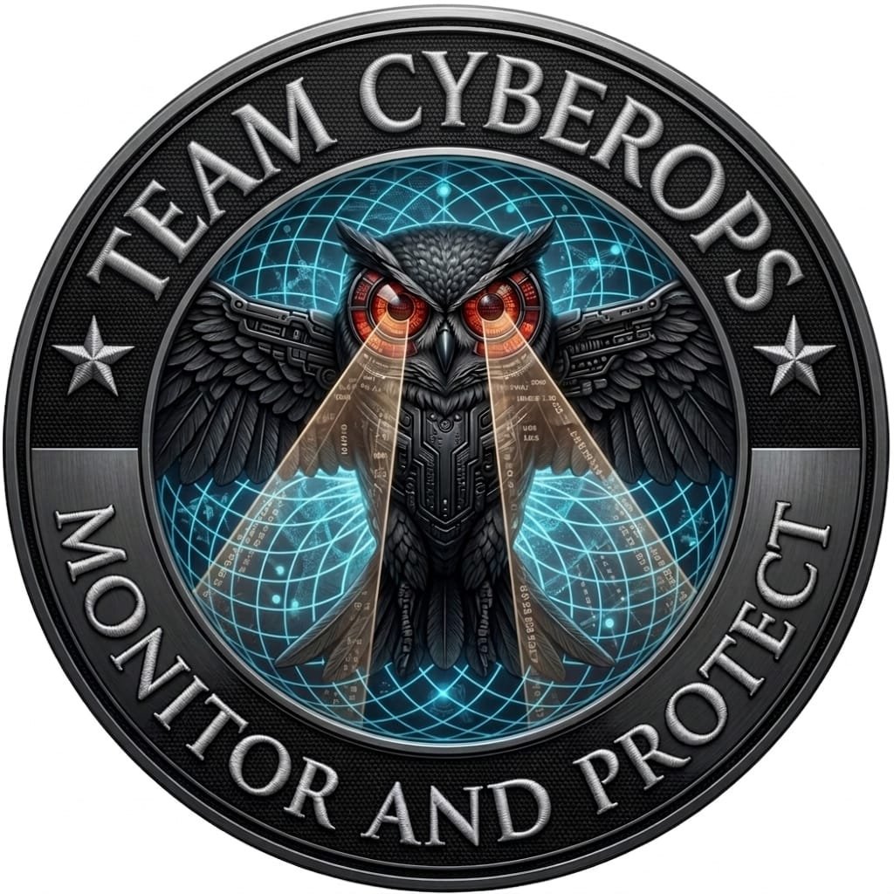

<div align="center">



# TeamCyberOps Suite

### v5.0 — Elite Bug Bounty Framework

**Monitor And Protect**

[](https://python.org)
[](https://github.com/TomSchimansky/CustomTkinter)
[](https://sqlite.org)
[](https://aistudio.google.com)
[](https://github.com/mohidqx)
[](LICENSE)

*by [mohidqx](https://github.com/mohidqx) · TeamCyberOps*

</div>

---

> **⚠ LEGAL NOTICE**
> This tool is for **authorized security testing and bug bounty hunting ONLY.**
> Always have written permission before testing any target.
> Developers are not responsible for misuse.

---

## Quick Start

```bash
# 1. Install
pip install customtkinter pillow requests psutil

# 2. Run
python main.py

# Default login
Username: admin
Password: admin
```

**Requires:** Python 3.9+ · Windows / Kali Linux / macOS

---

## Features — 52 Tabs

| Category | Tabs |
|----------|------|
| **RECON** | Auto-Recon · Passive · Active · Tor · URL Discovery · Dorks · Origin Hunter |
| **SCAN** | Vuln Scanner · Nuclei Mgr · Analysis · CVE Intel · Shodan · Mass Scanner |
| **EXPLOIT** | Exploitation · Payload Mgr · Chain Builder |
| **POWER** | OAST · JWT/OAuth · Race Condition · GraphQL · SSRF · 2FA Bypass · HTTP Smuggling · Proto Pollution · Cache Poison · CORS · Redirect · NoSQL · WebSocket · XXE · OAuth ATO |
| **INTEL** | OSINT · S3 Hunt · Subdomain TKO · Param Mining · Cred Stuffing · JWT Wordlist · SAST · API Tester |
| **RESULTS** | Findings · Results · Reports |
| **AI** | AI Assistant · AI Auto-Exploit · Smart Reporter · Nuclei AI Gen |
| **SYSTEM** | Settings · Wordlists · Tool Installer |

---

## AI Setup (Gemini — Free)

1. Get free API key → [aistudio.google.com](https://aistudio.google.com)
2. App → Settings → API Keys → Gemini API Key → Save

---

## Architecture

```
TeamCyberOps_v5/
├── main.py                    ← Entry point (29 lines)
├── app/
│   ├── core/
│   │   ├── database.py        ← SQLite WAL, thread-safe
│   │   └── config.py          ← Settings singleton + config.json sync
│   └── ui/
│       ├── theme.py           ← HUD/Sci-Fi design system
│       ├── login.py           ← Login window + org logo
│       ├── app_window.py      ← Main window + sidebar navigation
│       └── tabs/              ← 12 tab mixin files (52 tabs total)
├── modules/                   ← 42 security modules
│   ├── recon/                 ← passive, active, url_discovery, dorks, tor
│   ├── vuln/                  ← scanner, nuclei integration
│   ├── advanced/              ← oast, jwt, race, graphql, web_scanners...
│   ├── osint/                 ← engine (WHOIS, ASN, favicon, emails)
│   └── analysis/              ← CVE fetcher, security tools, JS analyzer
├── wordlists/                 ← Built-in wordlists (8 files)
├── docker/                    ← Dockerfile + docker-compose.yml
├── requirements.txt
├── CHANGELOG.md
├── CONTRIBUTING.md
└── LICENSE
```

---

## Optional Tools

All tools have Python fallbacks — install for better performance:

```bash
# Go tools
go install github.com/projectdiscovery/subfinder/v2/cmd/subfinder@latest
go install github.com/projectdiscovery/httpx/cmd/httpx@latest
go install github.com/projectdiscovery/nuclei/v3/cmd/nuclei@latest
go install github.com/projectdiscovery/katana/cmd/katana@latest
go install github.com/lc/gau/v2/cmd/gau@latest

# System
sudo apt install nmap nikto sqlmap tor
```

---

## Docker

```bash
cd docker && docker-compose up --build
```

---

## Contributing

See [CONTRIBUTING.md](CONTRIBUTING.md)

---

## License

[MIT License](LICENSE) · Copyright © 2026 TeamCyberOps (mohidqx)
